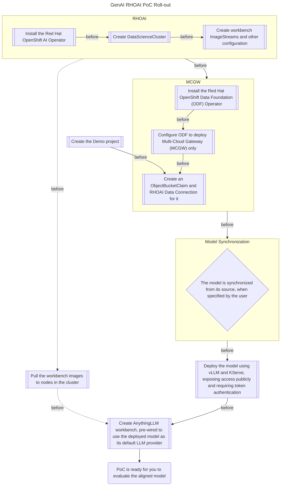

# WIP

This repository is a work-in-progress and is not recommended for use in a POC until complete.

## Info

Vanilla configurations for a RHOAI instance to deploy a GenAI POC. This will deploy a variety of different required services including an LLM interface (AnythingLLM), a local S3 bucket, and other services needed for a GenAI POC on RHOAI.

## Deploy POC Scaffolding

Use the [RHDP](https://demo.redhat.com) catalog item named "GenAI POC RHOAI 2025." This catalog item will deploy an OpenShift cluster on AWS with the following configurations:
- publicly trusted TLS keys
- some basic users
- an NVIDIA GPU node
- A few operator installations
  - NVIDIA GPU Operator
  - OpenShift Pipelines
  - OpenShift Serverless (for KServe)
  - OpenShift Service Mesh (for KServe)
  - OpenShift GitOps

OpenShift GitOps is then wired up to use this repository by applying the [bootstrap ApplicationSet](basic-vanilla-poc/bootstrap/applicationset/applicationset-bootstrap.yaml).

At this point, the automation has various gates to control linear roll-out of dependencies.

## Roll-out Explanation

