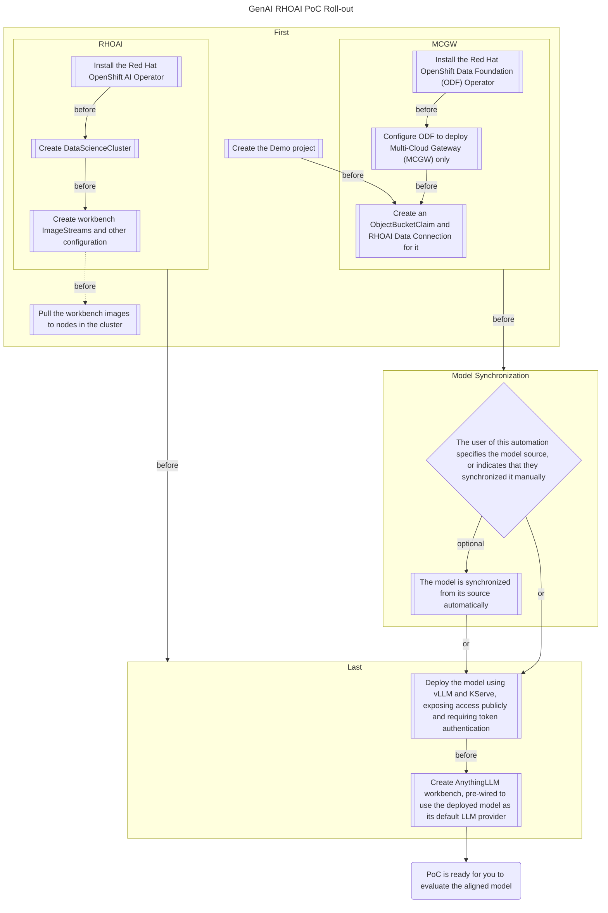

# WIP

This repository is a work-in-progress and is not recommended for use in a POC until complete.

## Info

Vanilla configurations for a RHOAI instance to deploy a GenAI POC. This will deploy a variety of different required services including an LLM interface (AnythingLLM), a local S3 bucket, and other services needed for a GenAI POC on RHOAI.

## Deploy POC Scaffolding

Use the [RHDP](https://demo.redhat.com) catalog item named "GenAI POC RHOAI 2025." This catalog item will deploy an OpenShift cluster on AWS with the following configurations:
- publicly trusted TLS keys
- some basic users
- an NVIDIA GPU node
- A few operator installations
  - NVIDIA GPU Operator
  - OpenShift Pipelines
  - OpenShift Serverless (for KServe)
  - OpenShift Service Mesh (for KServe)
  - OpenShift GitOps

OpenShift GitOps is then wired up to use this repository by applying the [bootstrap ApplicationSet](basic-vanilla-poc/bootstrap/applicationset/applicationset-bootstrap.yaml).

At this point, the automation has various gates to control linear roll-out of dependencies.

## Roll-out Explanation

Some visuals will, likely, be most useful in understanding what gets rolled out to support serving and interacting with your aligned model. Here is the general shape of the automation leveraged here:

There are two main phases for the automation, broken out simply as "First" and "Last" above. The "Model Synchronization" phase relies on user input, because the catalog item is generic and the aim is to deploy specific models. The automation for the "Last" section will all be hung up, waiting for the user to provide information on the model source so that synchronization can proceed.

There are several ways to get your model into the on-cluster object store. These are discussed in more detail [here](/docs/model-upload/README.md).

The final outcome, when all automation is complete, is a single AnythingLLM workbench with a default LLM provider configured to point to the on-cluster KServe endpoint, with a token included. After accessing the workbench, a new AnythingLLM Workspace can be created with the default options to begin chatting and performing the evaluation process. Refer to the PoC guide for any further details on what to do.
