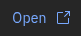
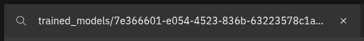
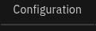
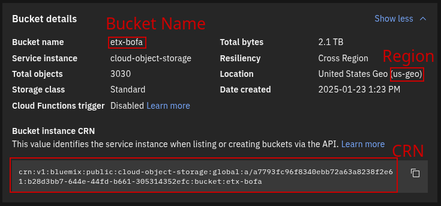
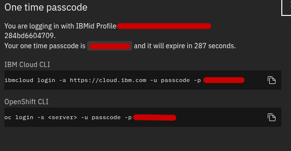

# Model Synchronization

The automation hangs in between the First and Last phases, waiting for model synchronization to complete before it can continue. The hanging, on a freshly provisioned cluster, occurs because a Kubernetes Secret has been specified as an Environment Variable source for a Kubernetes Job named `synchronize-model`. That Secret is not deployed by the automation. The content of that secret determines how the Job behaves. The Last phase of automation expects that completion of this Job means that the model has been completely uploaded to the ObjectBucketClaim's defined Bucket under the subdirectory `models/`.

There are several ways to get the job to complete, with three of the ones documented below requiring that you download the model to your workstation and two of them only requiring that your provide the credentials and configuration to access the model hosted somewhere accessible to the cluster, allowing the Job to perform the synchronization from directly inside the PoC cluster. Use whichever one works based on where your model is, what credentials you have access to, and whatever you're more comfortable with.

## Creating the Secret

To create the `model-source` Secret in the `demo` namespace, as any of the following methods require, you can edit one of the examples provided (and linked below where appropriate) and then use the `oc apply -f path/to/secret.yaml` or similar, if logged in on the command line. You can also copy the content of the Secret from the repository, use the  button in the top right of the OpenShift Console to access the "Import YAML" page, and then paste the secret content there before editing it to match the values you desire and clicking .

## Model Synchronization Options

1. [From a source S3 bucket](#source-s3-bucket-aws-s3-ibm-cos-with-a-service-account-etc) (synchronize inside cluster)
1. [From IBM COS via temporary passcode](#ibm-cos-via-temporary-passcode) (synchronize inside cluster)
1. [Local files via CLI (with automation)](#local-files-via-cli-with-automation) (uploaded from your workstation)
1. [Local files via ODH TECH upload](#local-files-via-odh-tec-upload) (uploaded from your workstation)
1. [Local files manually](#local-files-manually) (uploaded from your workstation)

### Source S3 bucket (AWS S3, IBM COS with a Service Account, etc.)

Your `model-source` Secret needs to contain the S3 credentials (and optionally the endpoint) of your source, the bucket the model is in, and any prefixes to the S3 key of the model files.

[Example S3 Secret](example-src-s3.yaml).

In this example, there is a bucket in AWS region `us-east-1` named `bucket`, and the model files are uploaded as, for example, `s3://bucket/folder/config.json` and `s3://bucket/folder/model-00001-of-00004.safetensors` etc. STS and other more robust authentication methods are not supported for this.

When this secret is created (using the methods described [above](#creating-the-secret)), with correct details for the model source, the `synchronize-model` job will synchronize the model directly from the source bucket into the on-cluster MCGW-backed bucket, allowing automation to continue with the Last phase.

### IBM COS via temporary passcode

Your `model-source` Secret needs to contain the information about the IBM COS instance you're using, the COS bucket for your model files, the key prefix for those files specifically, and an IBM COS temporary passcode (these expire quick!).

[Example IBM COS Secret](example-src-ibm.yaml).

To get the information needed to update the Secret:

1. Navigate to the  page
1. Find your model in the list and click  in the Object storage column
1. The Filter bar above your objects is pre-populated with the prefix for your model files inside the bucket. You need to update the Secret with this value, so copy from the field:
    - 
    - `S3_SYNC_COS_MODEL_PREFIX` should be updated to reflect this value
1. Click on  in the navigation bar under the bucket name
1. In the `Bucket Details` section, recover the following:
    - 
1. In the Secret, you'll need to update the following:
    - `S3_SYNC_COS_INSTANCE_REGION` with the region called out
    - `S3_SYNC_COS_BUCKET` with the bucket name called out
    - `S3_SYNC_COS_INSTANCE_CRN` with the Bucket CRN
1. When you are prepared to create the Secret with these updates, it's time to recover the temporary passcode for signing in. This passcode is only valid for five minutes, so you'll want to create the Secret very quickly after getting this temporary passcode.
    1. In the very top-right of the IBM Cloud navigation bar, click the Profile icon ()
    1. Select "Log in to CLI and API" from the menu
    1. Copy the one time passcode, only, without any extra flags, from any of the fields on the dialog, to update the Secret
        - 
        - `S3_SYNC_COS_TEMPORARY_PASSCODE` updated with this value
1. Create the secret using the methods described [above](#creating-the-secret)

### Local files via CLI (with automation)

There are a few prerequisites to running the upload automation successfully.

1. Linux or MacOS system. Windows users should be able to use WSL.
1. Have a valid local [kubeconfig](https://kubernetes.io/docs/concepts/configuration/organize-cluster-access-kubeconfig/) file. If you have `oc` installed locally, and are logged in using the normal means, this will be located at `~/.kube/config`. If you're using the `KUBECONFIG` environment variable to point to an alternate location, this will be respected.
1. Have `podman` installed and configured properly. If you're on a M-series Mac, for example, ensure that your `podman-machine` configuration is functional (can you run `podman run --rm registry.access.redhat.com/ubi9/ubi:latest grep PRETTY_NAME /etc/os-release` and see `PRETTY_NAME="Red Hat Enterprise Linux 9.5 (Plow)"` or similar as output?).
1. Have this repository either `git clone`'d or downloaded and un-archived.

To use the uploader:

1. Open a terminal to the location of your desired upload files. They don't need to be adjacent to the uploader, but you need to know the path to the repository you downloaded. You should be able to run `ls` and see the files, or a directory containing the files.
1. Run `upload.sh` from this repository and provide one or more relative paths to the files you want uploaded. For directories that you'd like to be fed directly to the model parent key in the bucket, include a trailing slash.

> [!WARNING]
> You must be in the correct directory, and only use a relative path that either is that directory (e.g. `./`) or is a child of that directory, when using the uploader. This is a limitation of the way it was made to be more portable. It will use both of these pieces of information to ensure that the model files are available to upload from inside a container.

For example, suppose you have the following directory structure:

```
/home/user/
├── Downloads
│   └── aligned-model
│       ├── config.json
│       └── example.safetensors
└── genai-rhoai-poc-template
    └── hack
        ├── overlay
        └── upload.sh
```

You would want to run:

```
cd ~/Downloads
ls
```

`aligned-model`

```
ls aligned-model
```

`config.json  example.safetensors`

```
~/genai-rhoai-poc-template/hack/upload.sh aligned-model/
```

`Building/updating image.`\
`Connecting to cluster: https://api.cluster.example.com:6443`\
`Recovering Data Connection information (when available from the cluster).`\
`+ /usr/local/bin/s3cmd sync --no-delete-removed aligned-model/ s3://demo-64d3c912-dd41-4ec5-bf3a-cff4895655b0/models/`\
`upload: 'aligned-model/config.json' -> 's3://demo-64d3c912-dd41-4ec5-bf3a-cff4895655b0/models/config.json'  [1 of 2]`\
` 518 of 518   100% in    0s  1306.29 B/s  done`\
`upload: 'aligned-model/example.safetensors' -> 's3://demo-64d3c912-dd41-4ec5-bf3a-cff4895655b0/models/example.safetensors'  [2 of 2]`\
` 1588 of 1588   100% in    0s     9.51 KB/s  done`\
`Done. Uploaded 2106 bytes in 0.3 seconds, 5.41 KB/s.`\
`+ /usr/local/bin/s3cmd ls s3://demo-64d3c912-dd41-4ec5-bf3a-cff4895655b0/models/`\
`2025-01-20 16:19          518  s3://demo-64d3c912-dd41-4ec5-bf3a-cff4895655b0/models/config.json`\
`2025-01-20 16:19         1588  s3://demo-64d3c912-dd41-4ec5-bf3a-cff4895655b0/models/example.safetensors`

Following this, you can trigger the automation to continue by following the finalization instructions [below](#manual-upload-finalization).

### Local files via ODH TEC upload

TODO

### Local files manually

TODO

#### Manual Upload Finalization

After the model files are uploaded manually, using any method, the `synchronize-model` Job remains unable to start. Because this Job is holding up the Last phase of the automation, we need to make it complete successfully. The Job will start if a Secret with the right name is created, and it will exit early if given a specific flag to indicate that a manual upload was created. You can use the method documented [above](#creating-the-secret) with a secret containing this value, unmodified from the example linked below, to trigger the rest of the automation to roll out. It's important that your model be uploaded not only to the bucket inside the cluster, but at the correct directory. Ensure that you're following the instructions in your chosen method for this to happen.

[Example Manual Upload Complete Secret](example-src-local.yaml).
